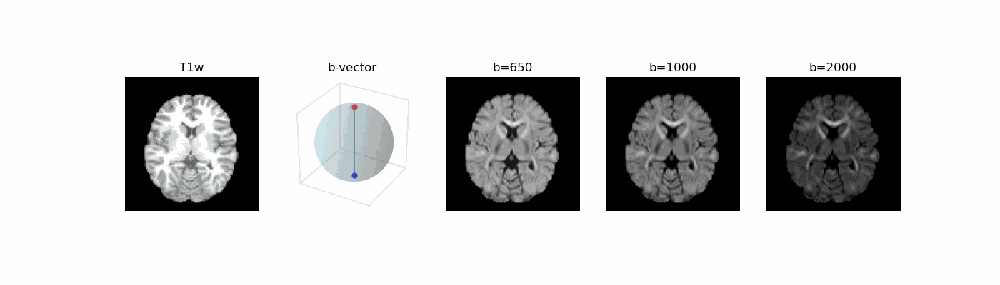
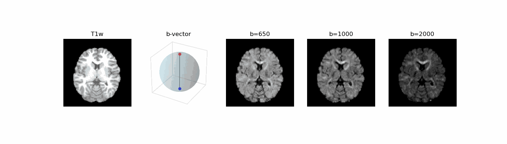

# diffusion-squared
Final Dissertation for MSc Computer Vision, Graphics, and Imaging at UCL

Project Title: Synthesis of Diffusion-Weighted Magnetic Resonance Images using Diffusion Models

Inspired by https://github.com/mengweiren/q-space-conditioned-dwi-synthesis 

NOTE: still transferring code to this repository...
